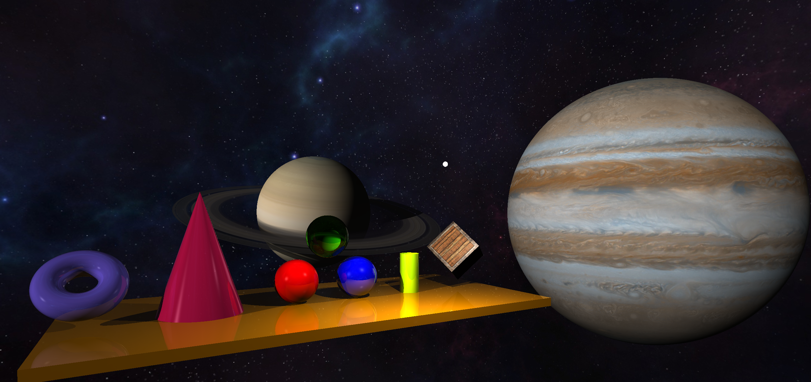

## Realtime raytracing

Implemented with OpenGL fragment shaders.

Scene setup in main.cpp source file.

### Features

Contains following geometric primititives:
- Sphere
- Box
- Ring
- Plane
- Torus
- Quadric surfaces:
  - Ellipsoid
  - Cone
  - Cylinder
  - Elliptic paraboloid
  - Hyperbolic paraboloid
  - Elliptic hyperboloid
  
Also:  
- SMAA antialiasing
- Texturing for sphere, box, ring
- Cubemaps
- Rotations with quaternions


### Controls:

Rotate camera with mouse

Movement:

- WASD
- Space - up
- Ctrl - down
- Shift (hold) - boost
- Alt (hold) - slowdown

### Requirements

* CMake (>= 3.0.2)
* GPU with OpenGL (>= 3.3) support
* GLM (included)
* GLFW, should be automatically found by CMake (win64 binaries included)

### Build
```sh
mkdir bin
cd bin
cmake ..
cmake --build .
```
#### GLFW for linux:
```sh
sudo apt install libglfw3-dev
```
#### GLFW for windows:
GLFW binaries included (common/GLFW), glfw3.lib compiled for Visual Studio 2019

You can use binaries for other VS versions from GLFW/win-x64 directory, or compile by yourself.

### Screenshots



